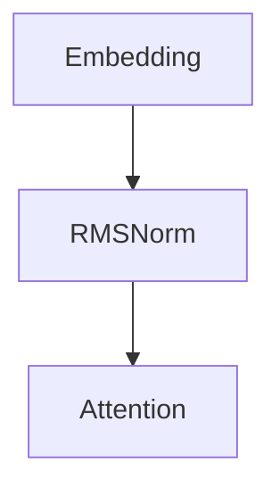

输入 ：  $input\\_ids \in R^{b \times seq_len \times d_model}$

步骤 1： 经过 Embedding, 得到 $input\\_embeds \in R^{b \times seq_len \times d_model}$

步骤 2：得到 $position\\_ids \in R^{1 \times seq\\_len} = [0, 1, ..., seq\\_len - 1]$

+ 步骤 3：得到 position_embeddings：
  + 步骤 3.1： $inv\\_feq \in R^{d_model/2} = [\frac{1}{base^{0/d\\_model}}, \frac{1}{base^{2/d\\_model}}, \frac{1}{base^{4/d\\_model}}, ..., \frac{1}{base^{(d\\_model-2)/d\\_model}}]$
  + 步骤 3.2: 将 inv_frq 进行扩展 $inv\\_freq\\_expanded \in R^{b \times d\\_model/2 \times 1}$
  + 步骤 3.3： 将 position_ids 扩展成 $position_ids_expanded \in R^{1 \times 1 \times seq\\_len}$
  + 步骤 3.4： 计算 freq = inv_freq_expanded @ position_ids_expanded \in R^{B \times d\\_model \times seq\\_len} = [[w_0 \times 0, w0 \times 2, w_0 \times (seq\\_len-1) 
+ 步骤 4: 进入解码层：
  + 步骤 4.1： 残差 residual
  + 步骤 4.2：对X做归一化操作

 $Variance \in R^{B \times seq\\_len \times 1}  = \frac{1}{\sqrt{\sum_{i}^{H}X_{i}^2} + \epsilon}$

 $x = x * vairance$

