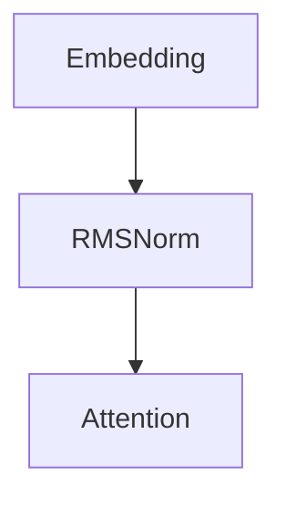

输入 ：  $X \in R^{B \times S \times D}$

+ B： Batch

+ S：Seq Len

+ D: d_model

步骤 1： 经过 Embedding, 得到 $D \in R^{B \times S \times D}$

步骤 2：得到 $position\\_ids \in R^{1 \times S} = [0, 1, ..., S - 1]$

+ 步骤 3：得到 position_embeddings：
  + 步骤 3.1： $inv\\_feq \in R^{D/2} = [\frac{1}{base^{0/D}}, \frac{1}{base^{2/D}}, \frac{1}{base^{4/D}}, ..., \frac{1}{base^{(D-2)/D}}]$
  + 步骤 3.2: 将 inv_frq 进行扩展 $inv\\_freq\\_expanded \in R^{b \times d\\_model/2 \times 1}$
  + 步骤 3.3： 将 position_ids 扩展成 $position_ids_expanded \in R^{1 \times 1 \times seq\\_len}$
  + 步骤 3.4： 计算 $freq = inv\\_freq\\_expanded @ position\\_ids\\_expanded \in R^{B \times d\\_model \times seq\\_len} = [[w_0 \times 0, w0 \times 2, w_0 \times (seq\\_len-1)$
+ 步骤 4: 进入解码层：
  + 步骤 4.1： 残差 residual
  + 步骤 4.2：对X做归一化操作

$$Variance \in R^{B \times seq\\_len \times 1}  = \frac{1}{\sqrt{\sum_{i}^{H}X_{i}^2} + \epsilon}$$

 $x1 = x * vairance$

$X1 = X @ B1$

+ 注意力头

$Q = RMSNorm(X @ B_q) ; B_Q \in R^{H \times H}$

$Q \in R^{B \times S \times H} 转置： Q \in R^{B \times H \times S}$

$K = RMSNorm(X @ B_k); B_k \in R^{H \times (NumKHead * dim)}$

$K = R^{B \times (numKHead * dim) \times S}$

$V = RMSNorm(X @ B_v); B_v \in R^{H \times (numKHead * dim)}$

$ V \in R^{B \times (numKHead * dim) \times S}$

+ 对 Q K 应用旋转编码

  

