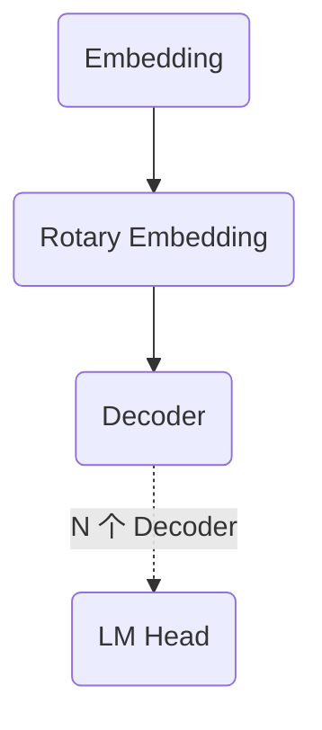

```mermaid
graph TD;
   A("Embedding")
   B("Rotary Embedding")
   C("Decoder")
   D("LM Head")

   A --> B
   B --> C
   C -.->|N 个 Decoder|D
```

|  | Qwen3-8B |
|---|---------|
| vocab size | 151936 |
| hiddex size | 4096 |
| num hidden layers | 36 |
